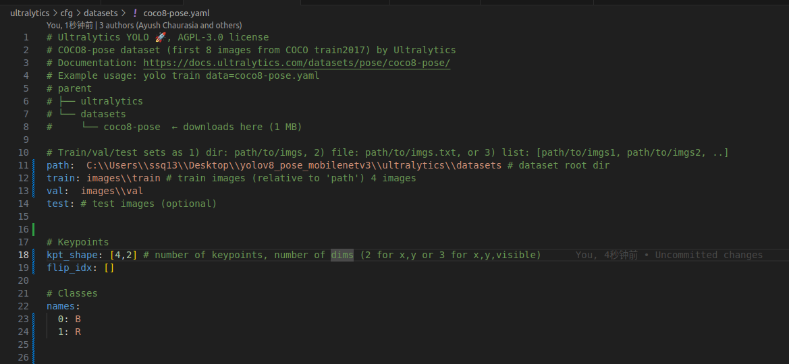

 **北京科技大学Reborn战队RM2024装甲板识别训练网络**
 =
 ### **Team: 北京科技大学Reborn <br>**

 ## 背景介绍：

 北京科技大学Reborn2024赛季 基于yolov8-pose的装甲板四点模型 神经网络训练代码
 ## 视频效果
 [text](<../../视频/录屏/录屏 2024年05月30日 12时30分26秒.webm>)

 ## 环境配置
 我们团队的训练配置和推理配置如下
 ***
 |硬件设备| 训练设备|推理设备|
 | - | - | - |
 | CPU | intel 13th i9 | Intel NUC 12th  |
 | GPU | NVIDA 3090 x 2 | Intel NUC 12th  |
 | 环境配置 |训练设备 |推理设备 |
| - | - | - |
| OS | win11 | Ubuntu 22.04 |
| CUDA | 12.1 | \ |
| OpenVINO | \ | 2023.3 |
|Python | 3.9 | 3.9 |
|Pytorch | 2.3.0 | \ |

 ***
## 特殊说明
由于YOLOv8采用 ```pip install ultralytics```配置环境，所以我们直接对安装的```ultralytics```包进行替换   
具体做法如下：  
* ```pip install ultralytics```
* 找到Anaconda\envs\环境名\Lib\site-packages下的ultralytics包
* 用我们的ultralytics替换原来的即可 

 ## 数据集格式
 与yolov8-pose要求的格式相同即可
 我们的标注顺序是： 
 + 一份对应的txt文件 1.txt 共一行，包含13个数据， 放置在 ```labels``` 目录下。其中每个数据的含义是:<br>
  第0位: 装甲板的类别<br>
  第1-4位: 装甲板标注锚框,用于目标检测。四个数的顺序是x,y,w,h，其中x,y,是锚框中心点的归一化坐标，w,h 是归一化相对宽高。<br>
  第5-14位: 装甲板灯条的边界点，从前到后分别是:<br>

* 左上角归一化坐标x1,y1<br>
* 左下角归一化坐标x2,y2<br>
* 右下角归一化坐标x3,y3<br>
* 右上角归一化坐标x4,y4<br>
  **```注意```** 图片和标注的文件名必须完全相同
  ## 训练流程<br>
  ### Train:
你的数据集配置文件应该像下面一样
    

  ```python train.py```
  ### Inference:
    ```python detect.py```
  ### Export:
  - 导出Openvino文件：<br>
  ```python export.py```
  ### Inference in Openvino
  暂未整理出
  ## 联系方式
  + 作者微信：wxid_30fyana8r4rc22
  + 作者邮箱：gaoxin_student@outlook.com
  + 团队邮箱：reborn_vision@163.com


